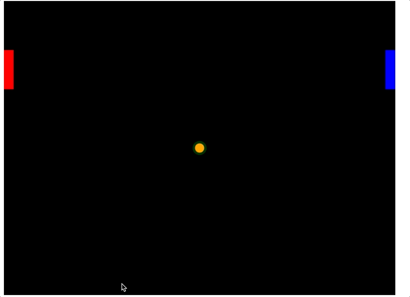

# arkanoid

We need to get a retro game Arkanoid, with minial features to just make it work

## Tasks that need to be implemented:
- Two panels 
- A ball which moves and respects the boundaries
- Follow basic laws of physics, just consider its a friction less environment.
- It can get a score counter for both panels.

## Tasks that can be done as improvments
- enable movement of panels with keys from keyboard
- play and pause the game
- enable two player mode.

